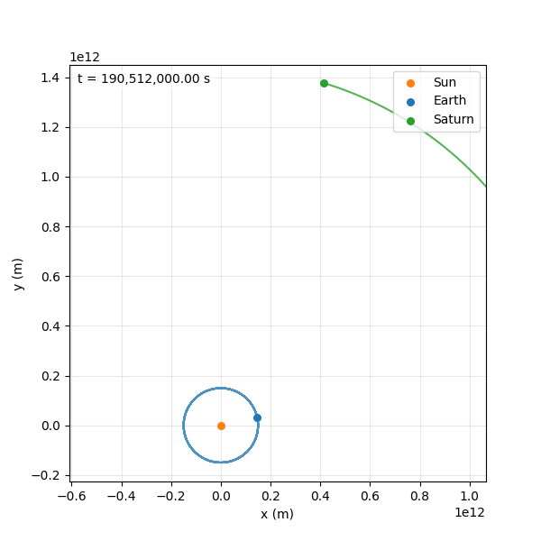

# Compte rendu de la 2e semaine

## Modélisation du problème

Afin de modéliser le problème à 3 corps nous nous ssommes basés sur le système d'équations différentielles défini par : 

$$\forall j\in \{1,\ldots ,N\},m_{j}{\ddot {\vec {q_{j}}}}=-G\sum _{k\in \{1,\ldots ,{\rm {{N}\}\backslash \{j\}}}}{\frac {m_{j}m_{k}\left({\vec {q_{j}}}-{\vec {q_{k}}}\right)}{\|{\vec {q_{j}}}-{\vec {q_{k}}}\|^{3}}}$$
(source: Wikipédia)
Avec:
* $q_j$ la position initiale du $j$-ième corps
* $m_j$ la masse du $j$-ième corps
* $G$ est la constante gravitationnelle

Cela nous donne le système suivant :
$$
\begin{equation}
  \left\{
      \begin{aligned}
        q_i'(t) = v_i(t)\\
        v_i'(t) = q_i''(t)
      \end{aligned}
    \right.
\end{equation}
$$

En posant $X_i(t) = \begin{pmatrix} q_i(t) \\ v_i(t) \end{pmatrix}$

Nous définissons un vecteur d'état et transformont le système en : $$\frac{dX_i}{dt} = \begin{pmatrix} v_i(t) \\ q_i''(t)\end{pmatrix}$$

## Résolution du problème
Afin de résoudre cette équation différentielle nous utilisons la méthode RK4 vu dans le cours. Afin d'avoir un rendu visuel, nous utilisons la fonction $matplotlib.FuncAnimation$

Nous avons implémenté le problème chacun de notre côté, afin de comprendre la fonctionnement de ce problème physique.
Nous avons également une développé une fonctionnalité permettant de fournir un fichier JSON contenant un modèle existant afin de visualiser le problème à 3 corps

Nous avons donc actuellement un moteur fonctionnel. Il nous reste à gérer le cas de la collision.
Le code se trouve sur : https://github.com/PaulPR-44/MNP
qui contient le tableau des tâches restantes (ci dessous une capture d'écran)

